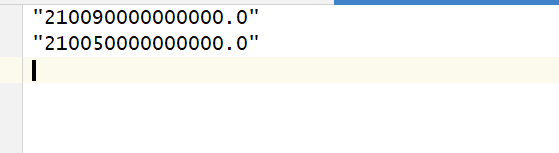

### 1.对公

#### 1.1 流失客户预警

**处理流程**

- 加载数据，数据加上表头，表头参见data_structure.xlsx，选取除包含"日期"之外的数据列用于模型训练

- 生成标签，根据定义：客户当期金融资产月日均较近三月下降比例超过50%。生成标签后，舍弃"金融资产月日均"和"近三个月金融资产月日均"这两个用于生成标签的列，增加"是否流失"这一标签列

- 去除含有空值的行

- 训练模型或使用模型预测

- 将预测为流失的客户写入文件。如下：

  

**运行方式**

项目目录下model/customer_losing.py 运行该脚本，参数有两个:input_data_path和output_data_path，分别为输入数据文件地址和输出结果文件地址

#### 1.2 潜客推荐

**处理流程**

- 加载数据，加上表头

- 生成标签，根据定义：月均交易笔数大于3笔或月均交易金额大于300万元为潜在客户。利用这两列生成标签后训练或推理时舍弃这两列。

- 训练模型或使用模型预测

- 在预测结果中筛选注册地址或经营地址包含广东字样的客户

- 将符合条件的客户编号写入文件中

  结果如下：

  

**运行方式**

项目目录下model/customer_potential.py 运行该脚本，参数有三个:input_data_path1、input_data_path2和output_data_path，分别为输入数据文件地址、输入关联数据文件地址和输出结果文件地址

### 2.对私(交叉销售和客户挖掘)

二者共用相同的数据结构，参见data_structure.xlsx

**实现分为两步：**

一是根据一些字段对客户进行聚类，聚类选取的字段为['年龄', '性别', '开户年限', '学历', '婚姻状况', '村民', '新市民', '代发客户', '按揭客户', '大学生客户', '股东客户', '企业主客户', '持有金融产品个数', '持有渠道产品个数', '签约消费渠道个数', '持有定期存款产品个数', '持有贷款产品个数', '持有理财产品个数', '持有保险产品个数', '持有基金产品个数', '持有国债产品个数', '持有高净值产品个数', '风险评级', '储蓄产品偏好', '理财产品偏好', '保险产品偏好', '基金产品偏好', '交易渠道偏好']；

二是在聚类的基础上使用另一些字段进行Apriori关联规则分析。

**处理流程：**

- 读取.del文件数据给数据,加上表头

- 去除含有空值的行

- 将聚类字段中的字符型数据转为数值型，依据是该字段取值列表的索引，比如某个客户的风险评级是低分险，该字段的取值列表是【低风险 中低风险 中风险 中高风险 高风险】，所以该客户的风险评级数值化结果是0。

- 根据10个余额情况['存款余额','保险余额','理财余额','基金余额','积存金余额','国债余额','高净值产品余额','贷款余额','信用卡分期余额']确定8个产品的持有情况，余额为0为不持有，非0为持有，历史余额不作为判断依据。其中贷款和信用卡视为一个产品，二者余额有一个不为0就视为持有，均为0为不持有，基金和积利宝同此。根据上面的操作生成了8个新列["存款","保险","基金和积利宝","积存金","理财","国债","代销资管产品","贷款和信用卡"]。

- 利用聚类模型对客户进行划分，得到n类客户群体的数据

- 每类客户分别进行关联规则分析，得到商品的关联结果，形式例如:{"['存款', '国债', '保险']": [['基金和积利宝'], 0.17909090909090908, 0.8354545454545454, 0.8477157360406092, 1.0146760714305443]},意思是拥有['存款', '国债', '保险']的客户，我们向他推荐['积存金', '基金和积利宝'],置信度是0.83。

- 利用客户已持有产品信息和关联规则，可以向客户推荐产品或者将产品推荐给目标客户

- 交叉销售结果如下(测试数据，客户编号随机生成，可能会相同)：

  

- 商品挖掘的结果如下：

  
  
  **使用方法：**

- 交叉销售

  项目目录下model/cross_selling.py  运行该脚本，参数有两个:input_data_path和output_data_path，分别为输入数据文件地址和输出结果文件地址

- 商品挖掘

  项目目录下model/product_mining.py  运行该脚本，参数有两个:input_data_path和output_data_path，分别为输入数据文件地址和输出结果文件地址

### 3.其他

- Python环境

  Python 3.5+

  库如下：

  scikit-learn                 0.22
  scipy                        1.8.0

  mlxtend                      0.22.0

  numpy                        1.22.2

  pandas                       1.4.1

- 模型文件

  默认放在项目目录的model/下面,名称和功能相对应，其中对私的两个功能共用一个模型retail_customer.pkl。流失预警的为customer_losing.pkl;潜客推荐的为customer_potential.pkl
